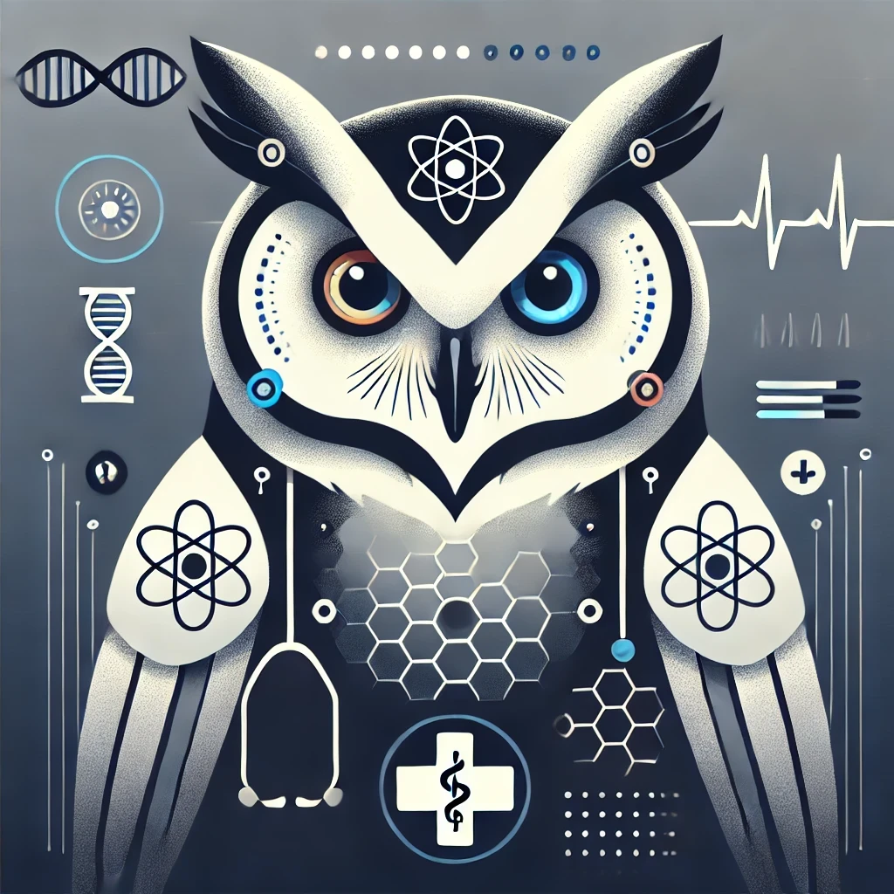

# MediDiagAi

**MediDiagAi** is an AI-powered diagnostic assistant designed for use in modern healthcare environments across the globe. It operates in two primary modes:

1. **Patient Chatbot Mode:**  
   - **Interactive Chatbot:** Engage with patients via a conversational interface that accepts both text and voice input.
   - **Multimodal Attachments:** Patients can easily attach files and images (e.g., medical reports, photos of symptoms) to enrich the interaction.
   - **Natural Language Understanding:** Leverages advanced NLP techniques to understand patient narratives, process voice input, and extract critical diagnostic information.

2. **Hospital Integration Mode:**  
   - **Pre-Diagnostic Support for Doctors:** Integrated within hospital systems, MediDiagAi analyzes patient data (including medical history, test results, and uploaded files) to generate a pre-diagnostic report.
   - **Decision Support:** Provides doctors with key insights and possible diagnoses, assisting in faster and more informed clinical decisions.
   - **Secure & Compliant:** Designed with data security and privacy in mind, meeting stringent standards required in healthcare environments.

---

## Project Overview

**MediDiagAi** is built using a modular and scalable architecture:
- **Backend:**  
  - Developed in Python with FastAPI and Pydantic to ensure robust data validation and efficient API handling.
  - Integrated Machine Learning models for natural language understanding and diagnostic prediction.
- **Performance Module:**  
  - Critical data processing and retrieval tasks are handled by Rust for enhanced performance.
- **Frontend:**  
  - A React-based web interface provides a user-friendly experience for both patients and healthcare professionals.
- **Chatbot & Multimedia Processing:**  
  - Incorporates cutting-edge technologies for processing text, voice, and image inputs, creating a seamless interaction experience.
- **Integration Capabilities:**  
  - Provides APIs and tools for integration with hospital systems, enabling real-time pre-diagnostic support.

---

## Key Features

- **Multimodal Interaction:**  
  Patients can communicate with the chatbot via text or voice and attach supporting documents or images.
  
- **Dual Operational Modes:**  
  - **Patient-Facing Chatbot:** Offers a conversational experience to guide patients and collect comprehensive health data.
  - **Doctor-Facing Integration:** Supplies healthcare providers with pre-diagnostic information to aid in clinical decision-making.
  
- **Secure & Scalable:**  
  Designed with a focus on security and scalability, ensuring reliable performance in demanding healthcare environments.

- **Extensible Architecture:**  
  The modular design allows for future enhancements, such as adding more advanced diagnostic models, expanding language support, and integrating additional data sources.

---

## Getting Started

For detailed setup instructions and further technical documentation, please refer to the files within the `docs/` folder.

---

## License

MediDiagAi is released under the [MIT License](LICENSE).

This license permits reuse, modification, and distribution of the software, both in source code and binary forms, as long as the original license and copyright
notice are included. It provides the freedom to use the code in both personal and commercial projects without many restrictions.

For the full text of the license, please see the [LICENSE](LICENSE) file.

## Contributing

Contributions to enhance MediDiagAi are welcome. Please see [CONTRIBUTING.md](docs/CONTRIBUTING.md) for more details.

---

## Contact

For any questions or suggestions, please contact [Your Email] or open an issue in the repository.
